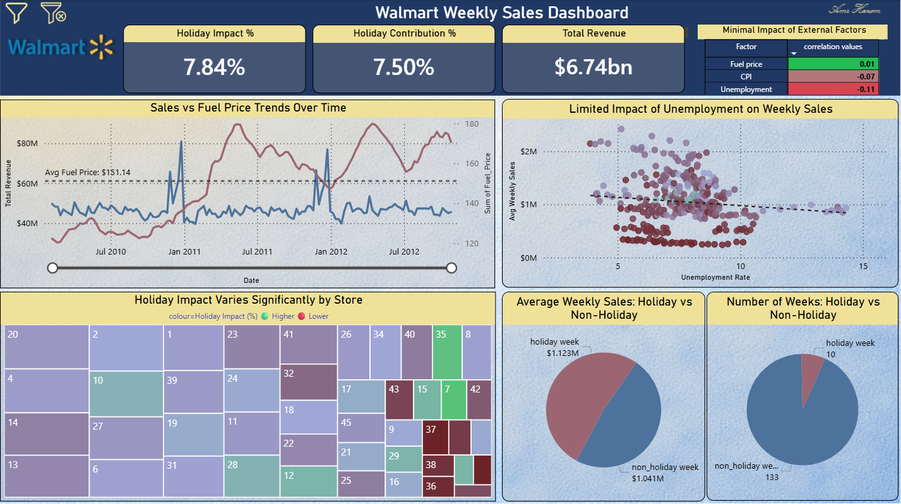
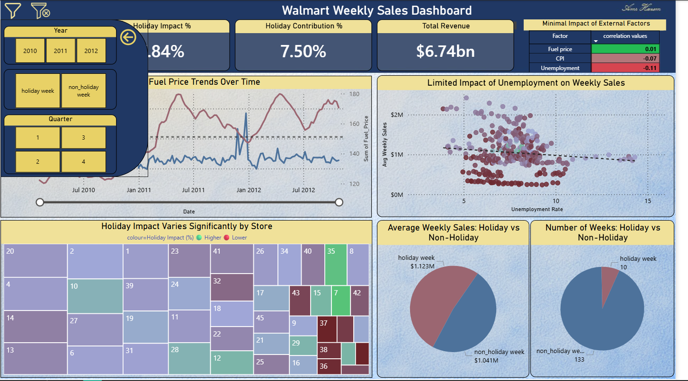

# Walmart Sales Analysis

A business intelligence project focused on analyzing Walmart's weekly sales performance across multiple stores, evaluating the impact of holidays and external economic factors, and uncovering trends that support strategic business decisions.

---

# Project Goal

The primary objective was to analyze Walmart's historical weekly sales data to identify the key drivers behind sales performance, measure the influence of holidays, and evaluate whether external economic indicators such as **Fuel Price**, **Unemployment**, and **CPI** significantly affect revenue.

The project helps business stakeholders optimize promotional planning, inventory management, and seasonal strategies through an interactive Power BI dashboard.

---

# Data Cleaning & Preparation

The dataset contained historical weekly sales records from multiple Walmart stores, along with holiday indicators and economic variables.

## Initial Data Exploration

- Performed descriptive statistical analysis.
- Examined data distributions and trends.
- Verified data types and business logic.
- Checked for duplicate records and inconsistent values.

## Data Validation

- Ensured each weekly sales record belonged to the correct store and date.
- Validated holiday flags against calendar periods.
- Verified external economic variables (Fuel Price, CPI, and Unemployment).

## Handling Missing Values

- Inspected missing values across all variables.
- Missing records were minimal and handled appropriately based on business context.
- Validated numerical values to avoid misleading KPIs.

## Data Transformation

- Created Date hierarchy (Year, Quarter, Month).
- Classified Holiday vs Non-Holiday periods.
- Built calculated columns for time intelligence.
- Standardized numeric formats for financial reporting.

###  Result

A clean analytical dataset was prepared for Power BI modeling with reliable historical sales records suitable for business analysis.

---

#  Data Modeling

A **Star Schema** was implemented to improve performance and simplify analysis.

### Fact Table

- Weekly Sales

### Dimension Tables

- Date
- Store
- Holiday
- Economic Indicators

Relationships were established between fact and dimension tables to enable efficient filtering and time-based analysis.

---

#  DAX Measures

Several business KPIs were created using DAX:

- Total Revenue
- Average Weekly Sales
- Holiday Contribution %
- Holiday Impact %
- Weekly Sales Trend
- Average Fuel Price
- Correlation Analysis
- Store Performance Metrics

---

#  Tools Used

- **Power BI** – Data Modeling, DAX, Dashboard Development
- **Excel** – Data Cleaning & Initial Data Exploration

---

# Power BI Dashboard

The project consists of a comprehensive executive dashboard that provides multiple analytical perspectives.

## Dashboard Features

- Executive KPI Cards
- Weekly Sales Trend
- Holiday Performance Analysis
- Store Comparison
- External Factors Correlation
- Interactive Filters
- Dynamic Drill-down by:
  - Year
  - Quarter
  - Holiday Type

---

#  Key Insights

## Holiday Performance

- Holiday weeks generated approximately **7.5%** of total revenue.
- Average weekly sales during holidays were significantly higher than regular weeks.
- Holidays consistently create predictable sales spikes.

---

## Store Performance

- Holiday impact varies considerably between stores.
- Some stores experience much stronger holiday sales growth.
- Regional customer behavior plays an important role.

---

## Sales Trend

- Weekly sales remain relatively stable throughout the year.
- Significant spikes occur during major holidays.
- Seasonal demand patterns repeat consistently each year.

---

## External Economic Factors

Correlation analysis shows that external economic indicators have minimal impact on weekly sales.

| Factor | Correlation |
|---------|------------:|
| Fuel Price | **0.01** |
| CPI | **-0.07** |
| Unemployment | **-0.11** |

### Interpretation

- Fuel prices have almost no measurable effect.
- CPI shows a very weak negative relationship.
- Unemployment has only a slight negative correlation.

Overall, Walmart's weekly revenue is influenced much more by holidays and seasonality than by short-term economic changes.

---

## Holiday vs Non-Holiday

- Holiday weeks generate significantly higher average weekly sales.
- Although they represent a small percentage of the calendar, they contribute disproportionately to total revenue.
- Seasonal campaigns have a substantial business impact.

---

#  Business Recommendations

## Marketing

- Increase promotional campaigns before major holidays.
- Allocate larger advertising budgets to seasonal events.

## Inventory Planning

- Increase inventory levels for stores with historically high holiday sales.
- Improve demand forecasting using historical holiday patterns.

## Store Management

- Identify top-performing stores during holidays.
- Replicate successful strategies across lower-performing locations.

## Financial Planning

- Prioritize seasonal demand over short-term economic indicators when forecasting revenue.

---

#  Conclusion

This project demonstrates that **seasonality and holidays are the primary drivers of Walmart's weekly sales**, while external economic indicators such as Fuel Price, CPI, and Unemployment have only a minimal influence.

Using Power BI dashboards, DAX measures, and interactive visualizations, this analysis provides business stakeholders with actionable insights to improve marketing strategy, inventory allocation, and operational planning.

---

#  Dashboard Preview

## Executive Dashboard


 

---

# 🔗 Live Demo

[**View the Interactive Dashboard Live Here**](https://app.powerbi.com/view?r=eyJrIjoiOTk0YWU0ODYtMGZjMC00OWRhLWI3NGUtNjMxMzIzNDNjMGM4IiwidCI6IjJiYjZlNWJjLWMxMDktNDdmYi05NDMzLWMxYzZmNGZhMzNmZiIsImMiOjl9)
---

#  Project Structure

```
Walmart-Sales-Analysis/
│
├── Dashboard.pbix
├── images/
│   └── dashboard.png
├── README.md
```
